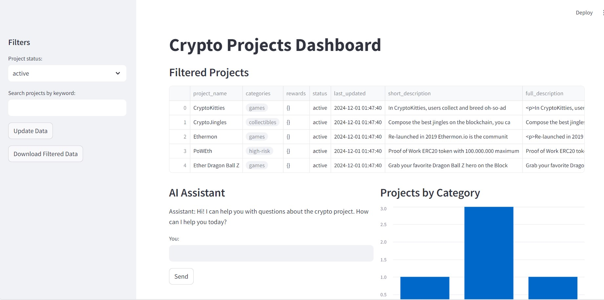
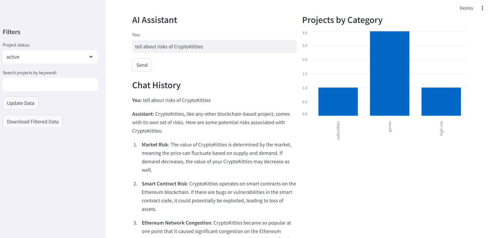
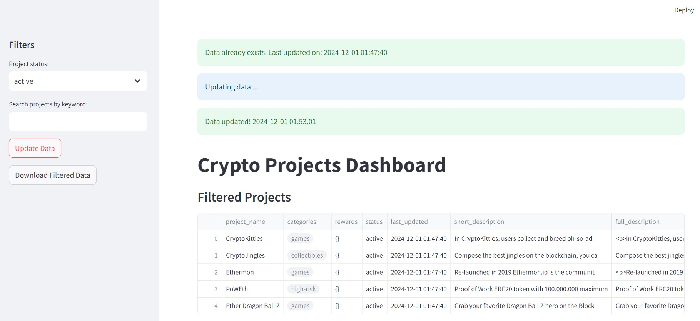

# 📊 Crypto Projects Dashboard

## 📖 Overview
The **Crypto Projects Dashboard** is a Python-based application that gathers, processes, and analyzes data about cryptocurrency projects. It provides a user-friendly interface for exploring data, filtering by criteria, and interacting with an AI assistant for project-related inquiries.

This project is divided into three main parts:
- **Data Collection**
- **Data Processing**
- **AI Assistant Integration**

---

## ✨ Features

### 🛠️ Data Collection
- 🔄 **Gathers information** on cryptocurrency projects via an API.
- 📁 **Data is stored** in a structured format as JSON files.
- Each project's details include:
  - 📌 **Project name**
  - 📝 **Description** (short and full)
  - 🧩 **Requirements**
  - 🎁 **Rewards**
  - 🌐 **Links to social platforms**
  - 📊 **Status**
  - 🕒 **Last updated date**

### ⚙️ Data Processing
- 🧹 Parses raw data into a **user-friendly format** for further analysis.
- 🔍 Includes functionality for:
  - Searching projects by **keywords**.
  - Filtering projects by **status** (e.g., active, ended).
  - Grouping projects by **category**.

### 🤖 AI Assistant
- Uses **OpenAI's GPT-4** to provide answers to user questions, such as:
  - ℹ️ Details about a specific project.
  - 🔄 Comparison of projects.
  - 💡 Recommendations based on requirements.
  - 💰 Potential benefit evaluations.

---

## 🚀 How It Works

### **Data Collection**
1. 📥 Projects are fetched via predefined IDs using an external API.
2. 🗃️ The fetched data is saved in `raw_data.json`.
3. 📂 Data is formatted and saved into `formatted_projects.json`.

### **Data Processing**
1. 🛠️ Prepares data for analysis by adding calculated columns like `balance` and `chains`.
2. 🔍 Provides search and filtering capabilities.

### **Streamlit Interface**
- **Users can:**
  - 🎛️ Filter projects by status.
  - 🔍 Search projects by keywords.
  - 🔄 Update data with a single click.
  - 📊 View projects grouped by category using a bar chart.
  - ⬇️ Download filtered data as a CSV file.

### **AI Assistant**
- 🧠 Integrated into the Streamlit interface.
- 💬 Answers user queries using project data.

---

## 📥 Installation

### **Prerequisites**
- 🐍 Python 3.8+
- 🔑 API Key for OpenAI GPT-4 and DappRADAR
- 📦 Required Python libraries (see `requirements.txt`)

### **Steps**

1. **Clone the repository:**
```bash
git clone https://github.com/Yevheniia-Ilchenko/CryptoProject_AI.git
````
2. **Install Required Python Packages**
```bash
 pip install -r requirements.txt 
```
3: **Add OpenAI API Key**

Create a .env file in the root directory and add your OpenAI API key and DappRAdar API KEY:
```bashenv

OPENAI_API_KEY=your_openai_api_key
KEY_DAPP_RADAR=your_dappradar_api_key
```

4: **Run the Streamlit App**
```bash

streamlit run streamlit_app.py
```

## 🌟 Key Features
## 🎛️ Interactive Dashboard

User-friendly filters and visualizations for exploring project data.
Filtering by Status
 - Select "active" or "ended" from the sidebar:
 - Searching by Keyword



## 🤖 AI Integration

Seamlessly integrates OpenAI GPT-4 for intelligent responses to queries.
 - Using the AI Assistant
 - Ask the AI Assistant questions



## 💾 Data Storage
Updates and stores project data in JSON format.


## ⬇️ Download Options
Export filtered project data as a CSV file.


